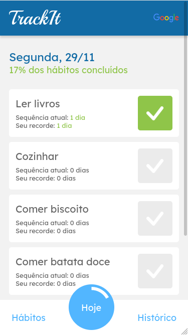
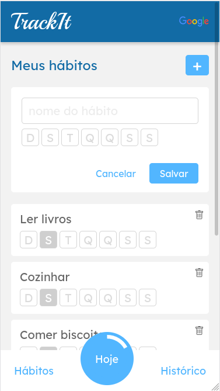

# TrackIt

TrackIt is a mobile habit tracking application built with React.

### How to run

Clone the repository into your machine:

    git clone https://github.com/jhonnatangomes/trackit-new

Then, head over to the newly created directory and install dependencies:

    cd trackit-new
    npm install

In order to run the project you can do:

    npm run start

Also, you can check out deployed version [here].

### How to use

After registering and logging, user is redirected to the 'today' page.

You can then use the bottom menu to navigate between different pages. In order to setup a new habit, just go to the habits section in the menu. In there, you can create a new habit and choose the corresponding days you want to do it.

Your newly created habit will appear on the habits page as well as on the today page. You can then check and uncheck different habits and the today progress bar on the menu will be automatically filled for each action.

[here]: http://trackit-new.vercel.app/
